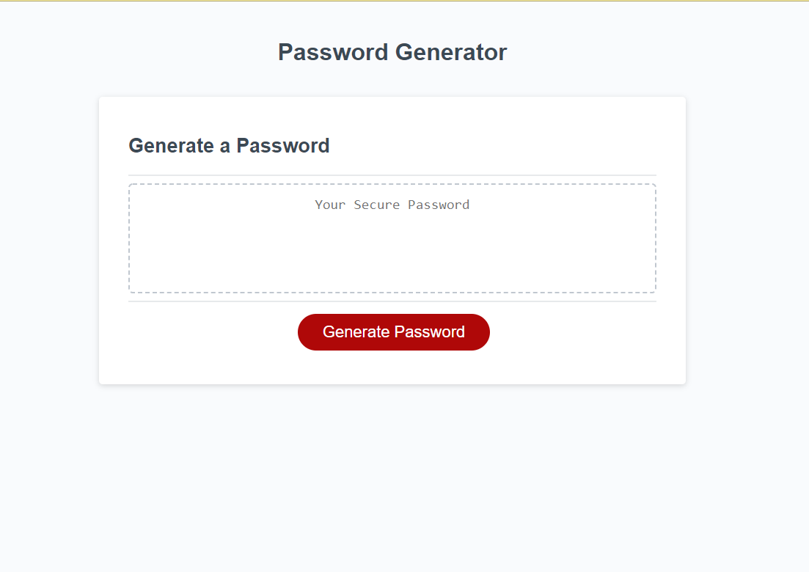

# Password Generator

Password Generator is repository where I have created an application that generates a random password based on user-selected criteria .The user can choose a length from 8 to 128 as well as four character types: uppercase, lowercase, numeric, and special characters. This results in a dynamic and interactive experience for the user. 

[Password Special Characters](https://www.owasp.org/index.php/Password_special_characters) was used to reference character list. 

A live link to my [Password Generator](https://nikolaslenning.github.io/password-generator/) is hosted on Github pages.

This application was authored by [Nikolas Lenning](https://github.com/nikolaslenning).